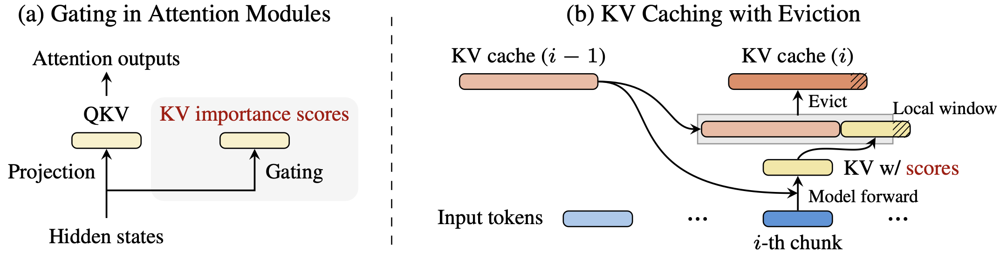

# Fast KVzip: Efficient and Accurate LLM Inference with Gated KV Eviction

[[Paper](http://arxiv.org/abs/2601.17668)]
[[Project Page](https://janghyun1230.github.io/fastkvzip/)]




## What's New

- <b>Fast KVzip</b> trains a <b>lightweight gating mechanism</b> for KV cache compression across both prefill
and decoding stages.
- Near-lossless performance on general tasks with up to a <b>70% KV cache eviction
ratio</b> while significantly improving attention efficiency.
- A <b>Low-Rank Sink Attention</b> gate architecture, trained by directly distilling importance scores from [KVzip](https://arxiv.org/abs/2505.23416) in under one H100 hour.
- [NVIDIA KVpress](https://github.com/NVIDIA/kvpress) adds support for Fast KVzip (see also [Leaderboard](https://huggingface.co/spaces/nvidia/kvpress-leaderboard)).

## Installation
Supported GPUs: NVIDIA Ampere (e.g, A100, RTX3090), and Hopper (e.g., H100).

```bash
pip install torch==2.7.0 --index-url https://download.pytorch.org/whl/cu128
pip install flash-attn==2.7.3 --no-build-isolation
cd csrc
make
cd ../prefill
pip install -r requirements.txt
```
We release trained gates for 
- Qwen/Qwen2.5-{7,14}B-Instruct-1M 
- Qwen/Qwen3-{8,14}B
- Qwen/Qwen3-8B-FP8
- Qwen/Qwen3-4B-Instruct-2507
- google/gemma-3-12b-it

Gates for these models will be automatically downloaded via HuggingFace.
- For other models, you first need to train gates. Please refer the to the section `Train Gates for New Models` in this README.


## Evaluation
- For prefill-intensive tasks, please refer to [`./prefill`](https://github.com/Janghyun1230/FastKVzip/tree/main/prefill).
- For decoding-intensive tasks, please refer to [`./math`](https://github.com/Janghyun1230/FastKVzip/tree/main/math).


## Train Gates for New Models
```bash
source train_gate.sh $model_name
```
- Results will be save at the ```./result_gate``` folder.
- After training gates, please corrects the `file_path` in the `get_gate_weight` function from `prefill/attention/gate.py` and `math/method/load_gate.py`.

## Acknowledgments
Our code is built upon the following open-source projects:
- [KVzip](https://github.com/snu-mllab/KVzip) (prefill-intensive tasks)
- [R-KV](https://github.com/Zefan-Cai/R-KV) (decoding-intensive tasks)

## Citation
```bibtex
@article{kim2026fastkvzip,
        title={Fast KVzip: Efficient and Accurate LLM Inference with Gated KV Eviction}, 
        author={Jang-Hyun Kim and Dongyoon Han and Sangdoo Yun},
        journal={arXiv preprint arXiv:2601.17668},
        year={2026},
}
```

